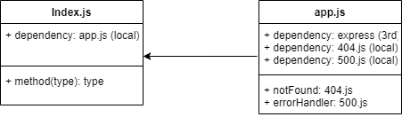

# LAB - 01

## Server Deployment Practice

### Author: Robert Shepley

- [Tests Report](https://github.com/ShepleySound/401-server-deployment-practice/actions/runs/3086816853)
- [Assignment Pull Request](https://github.com/ShepleySound/401-server-deployment-practice/pull/1)
- [Heroku Prod Deployment](https://shepley-server-deploy-prod.herokuapp.com/)

### Running the app

- `npm start`
- Endpoint: `/`
  - Response:
  
```json
  The server works!
```

- Endpoint: `/bad`
  - Returns JSON Object
  
```json
  {
    "error": 500,
    "route": "/bad",
    "query": {},
    "message": "Bad endpoint"
  }
```

### Tests

- Unit Tests: `npm run test`
- Lint Tests: `npm run lint`

### UML

(Created with [diagrams](https://app.diagrams.net/))


